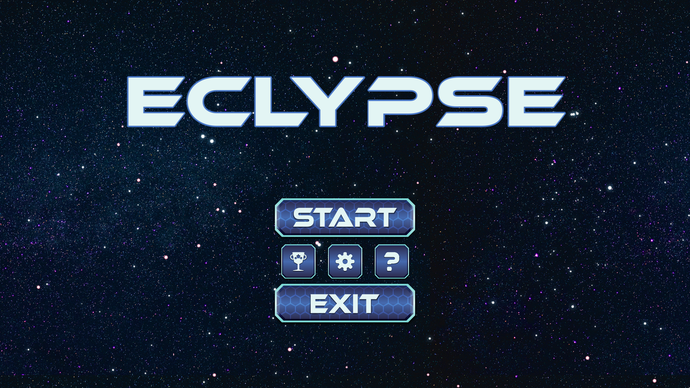
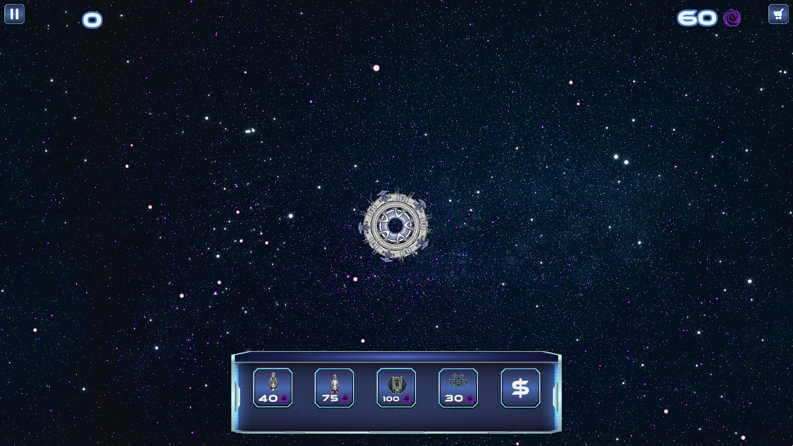
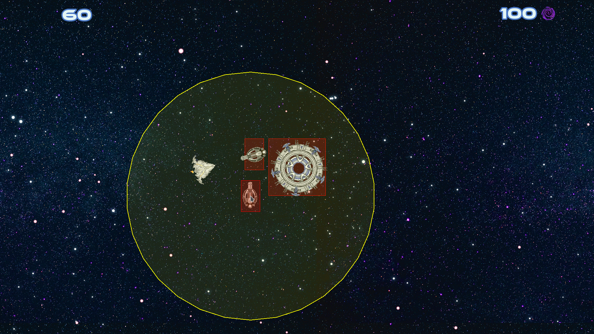
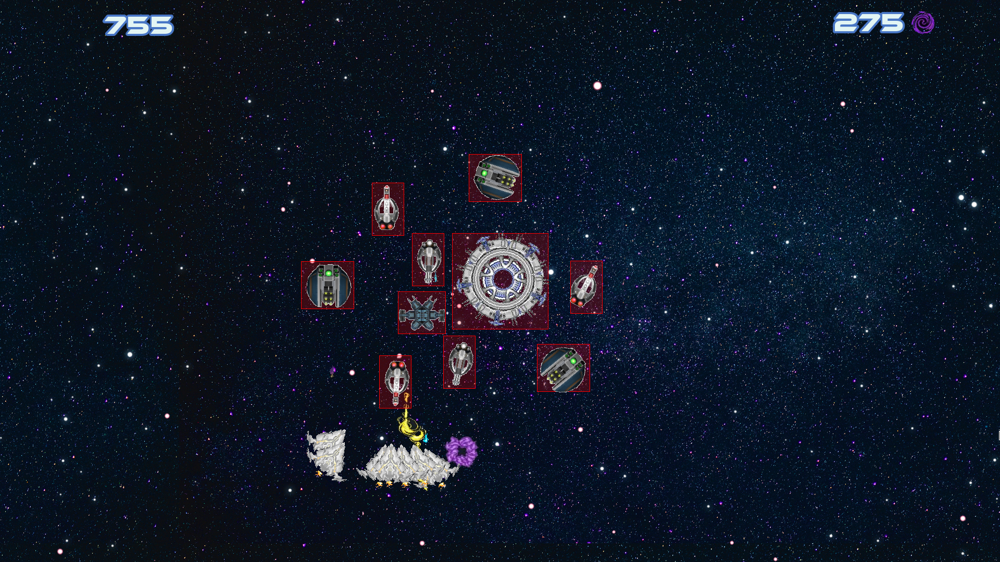
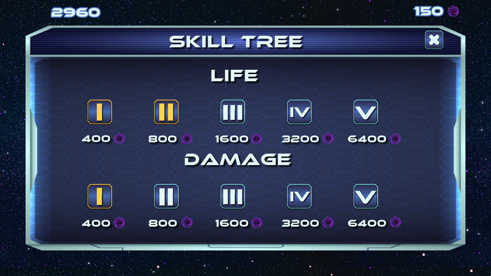
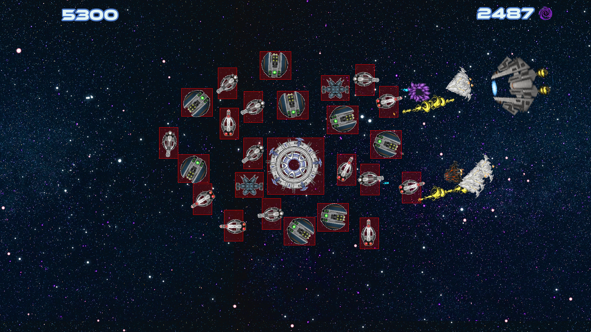
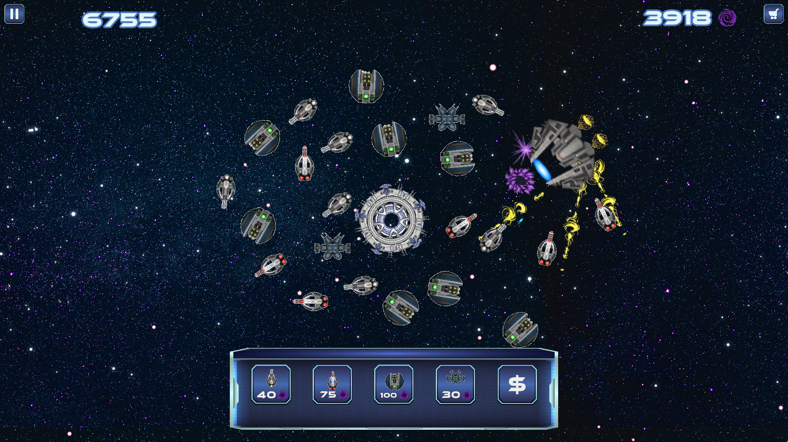

# My_Defender
Make a Tower-defense game with CSFML

This project is a Tower Defense game, made with language C with the graphics library CSFML.

Made with Quentin CAMILLERI

Rule of the project:

Your main challenge for this game will be to create nice and
smooth user interface and menus.

Your game must follow the following rules:

     - The player is a builder who must defend his castle,
     - Enemy waves will regularly appear from one side of the playground
     - The player must buy and place buildings on the playground grid to block/kill enemies
     - Buildings can be offensive (towers attacking) or defensive (basic walls)
     - When the castle is reached by an enemy, it takes damages
     - If the castle reaches 0 hit points the player loose.

Having a pleasant user interface is one of the details that makes a good quality game, this project is the
occasion for you to try your best on that topic.

How to play ?

For play you can do the command "make" to compile the program and run it with the command "./my_defender". After that you can run a game by clicking on the button "Play".
The only thing you do need is your mouse. You have "energy" and with this you can buy towers to defend your base. If you have a doubt you can open the "How to play" screen in the menu by clicking on the button "How to Play".

